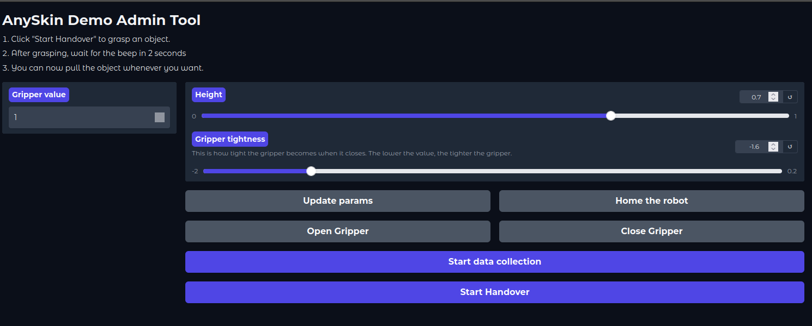

# Assemble gripper

AnySkin goes to left finger, silicone goes to right finger

Magnetometers are placed correctly, fitting the case

Port 7 goes to AnySkin, Port 0 goes to silicone

# Set up

1. Create venv environment:

```bash
python3 -m venv .venv
```

2. Install requirements:

```bash
source ./venv/bin/activate
python3 -m pip install -r requirements.txt
```

3. Install reskin library:

```bash
git clone git@github.com:NYU-robot-learning/reskin_sensor.git
cd reskin_sensor
python3 -m pip install -e .
```


# Starting UI

1. Home the robot:

```bash
stretch_robot_home.py
```

It might say "another process is using Robot" etc., follow it and complete the homing.

2. Make sure venv is not activated. Create different terminal panes in Tmux, run:
	
- robot server without activating venv:
```bash
cd robot_server
python3 start_server.py
```
Robot should move to the home position.
- Activate venv and reskin server:
```bash
source .venv/bin/activate
python3 reskin_server.py
```
if didn't start streaming, try a different port (it's either ACM5 which is the default or ACM6):
```
python3 reskin_server.py reskin_config.port="/dev/ttyACM6"
```
- Start the UI:
```bash
source .venv/bin/activate
python3 run.py
```

3. Forward port 7860, and go to `localhost:7860`. You will see the demo UI:



If you want to change the gripper tightness or the height of the arm, play with the sliders, then click "Update Params" and "Home the robot" in this order.

To do the demo:
- Place an object between grippers and click "Start Handover"
- Grippers will close 
- Wait until the robot beeps
- NOTE: it's important to let go of the object after grasping (I baseline the readings in this period)

- Then, you can pull it whenever you want. 
- NOTE: This demo is very robust. However, the longer object stays in the gripper, the likelier a false positive and gripper will open on its own. I tested up to 30 seconds for many objects and tested this by disturbing the robot.

